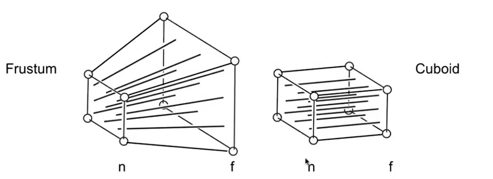

# **Lecture 4 - Tranformation Continued**

- **Date**: 2025/2/14 (情人节看GAMES101这辈子有了)

## **Contents**

- 3D transformations
- Viewing (观测) transformation
  - View (视图) / Camera transformation
  - Projection (投影) transformation
    - Orthographic (正交) projection
    - Perspective (透视) projection

## **3D Transformations**

### **Recall**

Use homogeneous coordinates again:

- 3D point = $(x, y, z, 1)^T$
- 3D vector = $(x, y, z, 0)^T$

Core idea: To make translation general.

In general, (x, y, z, w) (w != 0) is the 3D point:

``` math
(\frac{x}{w}, \frac{y}{w}, \frac{z}{w})
```

We use 4x4 matrices for affine transformations:

``` math
\begin{pmatrix} x' \\ y' \\ z' \\ 1 \end{pmatrix} =
\begin{pmatrix} a & b & c & t_{x} \\ d & e & f & t_{y} \\
g & h & i & t_{z} \\ 0 & 0 & 0 & 1 \end{pmatrix} \cdot
\begin{pmatrix} x \\ y \\ z \\ 1 \end{pmatrix}
```

Is the order Linear Transform first or Translation first?

- It will be linear map + translation (the same as 2D).

### **General Formulas**

Scale:

``` math
\mathbf{S}(s_{x}, s_{y}, s_{z}) =
\begin{pmatrix} s_{x} & 0 & 0 & 0 \\ 0 & s_{y} & 0 & 0 \\ 0 & 0 & s_{z} & 0 \\ 0 & 0 & 0 & 1 \end{pmatrix}
```

Translation:

``` math
\mathbf{T}(t_{x}, t_{y}, t_{z}) =
\begin{pmatrix} 1 & 0 & 0 & t_{x} \\ 0 & 1 & 0 & t_{y} \\ 0 & 0 & 1 & t_{z} \\ 0 & 0 & 0 & 1 \end{pmatrix}
```

Rotation around x-, y-, or z-axis:

``` math
\mathbf{R}_{x}(\alpha) =
\begin{pmatrix} 1 & 0 & 0 & 0 \\ 0 & cos\alpha & -sin\alpha & 0 \\ 0 & sin\alpha & cos\alpha & 0 \\ 0 & 0 & 0 & 1 \end{pmatrix}
```

``` math
\mathbf{R}_{y}(\alpha) =
\begin{pmatrix} cos\alpha & 0 & sin\alpha & 0 \\ 0 & 1 & 0 & 0 \\ -sin\alpha & 0 & cos\alpha & 0 \\ 0 & 0 & 0 & 1 \end{pmatrix}
```

``` math
\mathbf{R}_{z}(\alpha) =
\begin{pmatrix} cos\alpha & -sin\alpha & 0 & 0 \\ sin\alpha & cos\alpha & 0 & 0 \\ 0 & 0 & 1 & 0 \\ 0 & 0 & 0 & 1 \end{pmatrix}
```

Note:

- The coordinate of the axis rotated around does not change.
- The rotation is always counter-clockwise around the axis.

Compose any 3D rotation from $R_x$, $R_y$, $R_z$:

``` math
\mathbf{R}_{xyz}(\alpha, \beta, \gamma) = \mathbf{R}_x(\alpha)\mathbf{R}_y(\beta)\mathbf{R}_z(\gamma)
```

- So-called Euler angles.
- Often used in flight simulators: roll, pitch, yaw.
  - Roll: Roll left and right (x-axis).
  - Pitch: Pitch up and down (y-axis).
  - Yaw: Yaw left and right in horizontal direction (z-axis).

### **Rodrigues' Rotation Formula**

Rotation by angle $\alpha$ around axis n:

``` math
\mathbf{R}(\mathbf{n}, \alpha) = \cos(\alpha) \mathbf{I} + (1 - \cos(\alpha)) \mathbf{n} \mathbf{n}^T + \sin(\alpha)
\underbrace{\begin{pmatrix}
0 & -n_z & n_y \\
n_z & 0 & -n_x \\
-n_y & n_x & 0
\end{pmatrix}}_{\mathbf{N}}
```

**The Derivation of Rodrigues' Rotation Formula:**

> TODO

## **Viewing Transformation**

### **View / Camera Transformation**

Think about taking a photo: (MVP Process)

- Model Transformation: Find a good place and arrange people.
- View Transformation: Find a good "angle" to put the camera.
- Projection Transformation: Take the photo. (Project 3D space to a 2D photo.)

How to perform view transformation?

- Define the camera first:
  - Position $`\vec{e}`$.
  - Look-at / gaze direction $`\hat{g}`$.
  - Up direction $`\hat{t}`$.
- How do we always transform the camera to:
  - The origin, up at Y, look at -Z.
  - Transform the objects along with the camera.
- Transform the camera by $`M_{view}`$, so it is located at the origin, up at Y, look at -Z.
  - Translates e to origin.
  - Rotates g to -Z.
  - Rotates t to Y.
  - Rotates (g x t) to X.
- $`M_{view}`$ in math:
  - $`M_{view} = R_{view}T_{view}`$.
  - Translate e to origin.

``` math
T_{view} = \begin{bmatrix} 1 & 0 & 0 & -x_{e} \\ 0 & 1 & 0 & -y_{e} \\ 0 & 0 & 1 & -z_{e} \\ 0 & 0 & 0 & 1 \end{bmatrix}
```

- Rotate g to -Z, t to Y, (g x t) to X.
- What about its inverse rotation?

``` math
R_{\text{view}}^{-1} = \begin{bmatrix} x_{\hat{g} \times \hat{t}} & x_t & x - g & 0 \\ y_{\hat{g} \times \hat{t}} & y_t & y - g & 0 \\ z_{\hat{g} \times \hat{t}} & z_t & z - g & 0 \\ 0 & 0 & 0 & 1 \end{bmatrix}
```

``` math
R_{\text{view}} = \begin{bmatrix} x_{\hat{g} \times \hat{t}} & y_{\hat{g} \times \hat{t}} & z_{\hat{g} \times \hat{t}} & 0 \\ x_t & y_t & z_t & 0 \\ x - g & y - g & z - g & 0 \\ 0 & 0 & 0 & 1 \end{bmatrix}
```

- Tranform objects together with the camera.
- Until camera is at the origin, up at Y, look at -Z.
- Also known as ModelView Transformation.

### **Projection Transformation**

Projection in Computer Graphics

- 3D to 2D
- Orthographic projection
- Perspective projection
- 近大远小 or 透视投影

**Orthographic Project (正交投影):**

- A simple way to set up:
  - Camera located at origin, looking at -Z, up at Y.
  - **Drop Z coordinate.**
  - Translate and scale the resulting rectangle to $`[-1, 1]^2`$.
- In general:
  - We want to map a suboid $`[l, r] \times [b, t] \times [f, n] `$ tp the "canonical" cube $`[-1, 1]^3`$.
- Slightly different orders:
  - Center cuboid by translating.
  - Scale into "canonical" cube.
- Transformation matrix:
  - Translate (center to origin) first, then scale (legnth/width/height to 2)

  ``` math
  M_{\text{ortho}} = \begin{bmatrix} \frac{2}{r - l} & 0 & 0 & 0 \\ 0 & \frac{2}{t - b} & 0 & 0 \\ 0 & 0 & \frac{2}{n - f} & 0 \\ 0 & 0 & 0 & 1 \end{bmatrix} \begin{bmatrix} 1 & 0 & 0 & -\frac{r + l}{2} \\ 0 & 1 & 0 & -\frac{t + b}{2} \\ 0 & 0 & 1 & -\frac{n + f}{2} \\ 0 & 0 & 0 & 1 \end{bmatrix}
  ```

- Caveat
  - Looking at / along -Z is making near and far not intuitive (n > f).
  - FYI: That's why OpenGL uses left hand coords.

**Perspective Projection (透视投影):**

- Further objects are smaller. Parallel lines are not parallel; converge to single point.
- Recall property of homogeneous coordinates:
  - $`(x, y, z, 1)`$, $`(kx, ky, kz, k \neq 0)`$, $`(xz, yz, z^2, z \neq 0)`$ all represent the same point $`(x, y, z)`$ in 3D.
  - e.g. (1, 0, 0, 1) and (2, 0, 0, 2) both represent (1, 0, 0).
- How to do perspective projection?
  - First "squish" the frustum into a cuboid (n -> n, f -> f).
  - Do orthographic projection ($`M_{\text{ortho}}`$).
  
- In order to find a transformation:
  - Recall: Find the relationship between transformed points (x', y', z') and the original points (x, y, z).

    ``` math
    \begin{matrix} y' = \frac{n}{z}y \\ x' = \frac{n}{z}x \end{matrix}
    ```

  - This is the scaling of a similar triangles.
  - In homogeneous coordinates,

    ```math
    \begin{pmatrix}
    x \\
    y \\
    z \\
    1
    \end{pmatrix}
    \Rightarrow
    \begin{pmatrix}
    \frac{n x}{z} \\
    \frac{n y}{z} \\
    \text{unknown} \\
    1
    \end{pmatrix}
    \xRightarrow{\text{mult. by z}}
    \begin{pmatrix}
    n x \\
    n y \\
    \text{still unknown} \\
    z
    \end{pmatrix}
    ```

  - So the "squish" (perspective to orthogonal) projection does this:

    ``` math
    M_{\text{persp} \to \text{ortho}}^{(4 \times 4)}
    \begin{pmatrix}
    x \\
    y \\
    z \\
    1
    \end{pmatrix}
    =
    \begin{pmatrix}
    n x \\
    n y \\
    \text{unknown} \\
    z
    \end{pmatrix}
    ```

- Find the third row,
  - Observation: The third row is responsible for z'.
    - Any point on the near plane will not change.
    - Any point's z on the far plane will not change.
  - Any point on the near plane will not change,

  ``` math
    M_{\text{persp} \to \text{ortho}}^{(4 \times 4)}
    \begin{pmatrix}
    x \\
    y \\
    z \\
    1
    \end{pmatrix}
    =
    \begin{pmatrix}
    n x \\
    n y \\
    \text{unknown} \\
    z
    \end{pmatrix}
    \xRightarrow{\text{replace z with n}}
    \begin{pmatrix}
    x \\
    y \\
    n \\
    1
    \end{pmatrix}
    \equiv
    \begin{pmatrix}
    n x \\
    n y \\
    n^2 \\
    n
    \end{pmatrix}
    ```

  - So the third row must be of the form (0 0 A B),

  ``` math
  \begin{pmatrix}
  0 & 0 & A & B
  \end{pmatrix}
  \begin{pmatrix}
  x \\
  y \\
  n \\
  1 \\
  \end{pmatrix}
  = n^2
  \Rightarrow
  An + B = n^2
  ```

  - Any point's z on the far plane will not change.

  ``` math
  Af + B = f^2
  ```

- Solve for A and B,

``` math
\begin{matrix} A = n + f \\ B = -nf \end{matrix}
```

- Therefore, $`M_{persp} = M_{ortho}M_{persp \rightarrow ortho}`$
